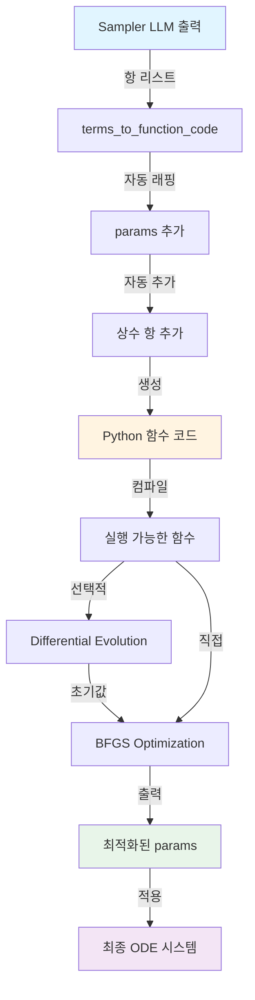

# 계수 최적화 과정 (Parameter Optimization Process)

이 문서는 Sampler LLM이 제안한 항(term) 리스트가 어떻게 실행 가능한 Python 함수로 변환되고, Differential Evolution과 BFGS를 통해 최적의 계수(params)를 찾는 전체 과정을 설명합니다.

**실제 예시**: ode_031 (SIR 전염병 모델)

---

## 1. Sampler 출력 → 항 리스트

### 1.1 Sampler LLM의 출력 형식

Sampler는 각 차원(dimension)별로 **`params[]`를 포함한 항(term) 리스트**를 제안하도록 지시받습니다:

```json
{
  "ode_pairs": [
    {
      "x0_t": [
        {
          "term": "params[0]*x0*x1",
          "reasoning": "질량 작용 전파 역학을 나타냄"
        }
      ],
      "x1_t": [
        {
          "term": "params[0]*x0*x1",
          "reasoning": "새로운 감염으로 인한 증가"
        },
        {
          "term": "params[1]*x1",
          "reasoning": "회복 또는 제거"
        }
      ],
      "pair_reasoning": "SIR 역학의 핵심 메커니즘 구현"
    }
  ]
}
```

**주요 특징:**
- **프롬프트 지시**: `params[0]*x0` 형식 사용 (예: `["params[0]*x0", "params[1]*x1"]`)
- **실제 LLM 출력**: `params[]` 포함 형식 또는 구체적 계수 형식 (`-0.4000*x0*x1`) 모두 가능
- **시스템 처리**: `params[]` 없는 항은 자동으로 `params[N]*(term)` 형태로 래핑
- 각 항마다 물리적/수학적 근거(reasoning)가 포함됩니다


---

## 2. 항 리스트 → Python 함수 코드

### 2.1 자동 변환 과정 (`terms_to_function_code`)

시스템은 항 리스트를 받아 다음 단계를 거쳐 Python 함수로 변환합니다:

#### **Step 1: params 인덱스 정규화 (Remapping)**

LLM이 임의의 인덱스를 사용한 경우, 0부터 연속적으로 재매핑합니다:

```python
# LLM 출력 (잘못된 인덱스)
["params[3]*x0", "params[7]*x1", "params[10]*np.sin(x0)"]

# 자동 재매핑 후
["params[0]*x0", "params[1]*x1", "params[2]*np.sin(x0)"]

# 매핑 정보: {3: 0, 7: 1, 10: 2}
```

**목적:**
- LLM이 프롬프트를 잘못 이해하여 `params[3]`부터 시작하는 경우 자동 수정
- 중간에 빠진 인덱스가 있어도 연속적으로 재정렬
- 최적화 과정에서 불필요한 파라미터 낭비 방지

#### **Step 2: params[] 자동 래핑**

`params[]`가 없는 항은 자동으로 `params[N]*(term)` 형태로 래핑됩니다:

```python
# 입력 항
"-0.4000*x0*x1"

# 자동 래핑 후
"params[0]*(-0.4000*x0*x1)"
```

#### **Step 3: NumPy 함수 접두사 자동 추가**


`sin`, `cos`, `exp` 등의 함수에 `np.` 접두사가 자동으로 추가됩니다:

```python
# 입력
"params[0]*sin(x0)"

# 자동 수정
"params[0]*np.sin(x0)"
```

#### **Step 4: 상수 항 자동 추가**

모든 함수에 상수 항(`params[N] * 1`)이 자동으로 추가됩니다:

```python
# 사용자 제안 항들
"params[0]*(-0.4000*x0*x1)"

# 시스템이 자동 추가
"params[0]*(-0.4000*x0*x1) + params[1] * 1"
```

#### **Step 5: 완전한 Python 함수 생성**

최종적으로 실행 가능한 Python 함수 코드가 생성됩니다:

```python
def x0_t(x0, x1, params):
    import numpy as np
    return (params[0]*(-0.4000*x0*x1)) + params[1] * 1

def x1_t(x0, x1, params):
    import numpy as np
    return (params[0]*(0.4000*x0*x1)) + (params[1]*(-0.3140*x1)) + params[2] * 1
```

### 2.2 실제 변환 예시 (ode_031)

| Sampler 제안 | 자동 래핑 | 상수 항 추가 | 최종 함수 |
|:---|:---|:---|:---|
| `"-0.4000*x0*x1"` | `"params[0]*(-0.4000*x0*x1)"` | `+ params[1] * 1` | `def x0_t(x0, x1, params): return (params[0]*(-0.4000*x0*x1)) + params[1] * 1` |
| `"0.4000*x0*x1"`, `"-0.3140*x1"` | `"params[0]*(0.4000*x0*x1)"`, `"params[1]*(-0.3140*x1)"` | `+ params[2] * 1` | `def x1_t(x0, x1, params): return (params[0]*(0.4000*x0*x1)) + (params[1]*(-0.3140*x1)) + params[2] * 1` |

---

## 3. Python 함수 → 최적화된 계수

### 3.1 최적화 파이프라인

생성된 Python 함수는 다음 두 단계의 최적화를 거칩니다:

```
┌─────────────────────────────────────────────────────────────┐
│  Step 1: Differential Evolution (선택적)                     │
│  - 전역 최적화 (Global Optimization)                         │
│  - 넓은 탐색 범위에서 좋은 초기값 찾기                        │
│  - 범위: [-100, 100] (config.DE_BOUNDS)                     │
└─────────────────────────────────────────────────────────────┘
                            ↓
┌─────────────────────────────────────────────────────────────┐
│  Step 2: BFGS (항상 실행)                                    │
│  - 지역 최적화 (Local Optimization)                          │
│  - 정밀한 미세 조정                                           │
│  - 초기값: DE 결과 또는 np.ones(max_params)                  │
└─────────────────────────────────────────────────────────────┘
```

### 3.2 손실 함수 (Loss Function)

최적화의 목표는 **MSE (Mean Squared Error)**를 최소화하는 것입니다:

```python
def loss_function(params: np.ndarray) -> float:
    # 1. 함수에 params 전달하여 예측값 계산
    y_pred = func(x0, x1, params)
    
    # 2. 실제값(ground truth)과 비교
    y_true = df['x0_t'].values  # 또는 'x1_t' 등
    
    # 3. MSE 계산
    mse = np.mean((y_pred - y_true) ** 2)
    
    return mse
```

**NaN/Inf 처리:**
- 예측값에 NaN 또는 Inf가 있으면 `PENALTY_VALUE` (매우 큰 값) 반환
- 최적화 과정에서 해당 파라미터 조합을 회피하게 됨

### 3.3 Differential Evolution (DE)

**목적**: 넓은 범위에서 전역 최적해에 가까운 초기값 찾기

```python
from scipy.optimize import differential_evolution

# 설정
bounds = [(-100, 100)] * max_params  # 각 파라미터의 탐색 범위
config = {
    'strategy': 'best1bin',
    'maxiter': 1000,
    'popsize': 15,
    'tol': 0.01,
    'atol': 0.0,
    'mutation': (0.5, 1),
    'recombination': 0.7,
    'seed': None,
    'workers': 1
}

# 실행
result = differential_evolution(loss_function, bounds, **config)
de_params = result.x  # 최적화된 파라미터
de_score = result.fun  # 최종 MSE 값
```

**특징:**
- 진화 알고리즘 기반 (유전 알고리즘과 유사)
- 다수의 후보 해(population)를 동시에 탐색
- 지역 최적해(local optima)에 빠질 위험이 적음
- 계산 비용이 높지만 좋은 초기값 제공

### 3.4 BFGS Optimization

**목적**: DE 결과를 초기값으로 사용하여 정밀한 최적화 수행

```python
from scipy.optimize import minimize

# 초기값 설정
if use_differential_evolution:
    initial_params = de_params  # DE 결과 사용
else:
    initial_params = np.ones(max_params)  # 모두 1로 초기화

# BFGS 실행
result = minimize(
    loss_function,
    initial_params,
    method='BFGS',
    options={
        'maxiter': 1000,
        'gtol': 1e-5  # Gradient tolerance
    }
)

best_params = result.x  # 최종 최적화된 파라미터
```

**특징:**
- Quasi-Newton 방법 (2차 미분 근사)
- 빠른 수렴 속도
- 좋은 초기값이 있을 때 매우 효과적
- 지역 최적해에 수렴할 수 있음 (따라서 DE로 좋은 초기값 찾기)

### 3.5 병렬 처리

모든 (ODE pair, dimension) 조합이 **동시에 병렬로** 최적화됩니다:

```python
from multiprocessing import Pool

# 모든 평가 작업 준비
eval_tasks = []
for pair in ode_pairs:
    for func_name in ['x0_t', 'x1_t']:
        code = pair['codes'][func_name]
        eval_tasks.append((code, func_name, df_train, y_true, max_params, ...))

# 병렬 실행
with Pool(processes=cpu_count()) as pool:
    results = pool.map(_evaluate_single_candidate, eval_tasks)
```

**효율성:**
- CPU 코어 수만큼 동시 처리
- 전체 실행 시간 대폭 단축

---

## 4. 실제 예시: ode_031 최적화 결과

### 4.1 입력 (Sampler 제안)

```json
{
  "x0_t": [{"term": "-0.4000*x0*x1"}],
  "x1_t": [
    {"term": "0.4000*x0*x1"},
    {"term": "-0.3140*x1"}
  ]
}
```

### 4.2 변환된 Python 함수

```python
def x0_t(x0, x1, params):
    import numpy as np
    return (params[0]*(-0.4000*x0*x1)) + params[1] * 1

def x1_t(x0, x1, params):
    import numpy as np
    return (params[0]*(0.4000*x0*x1)) + (params[1]*(-0.3140*x1)) + params[2] * 1
```

### 4.3 최적화된 계수 (Differential Evolution + BFGS)

**x0_t 파라미터:**
```python
[
    1.0000494845647356,    # params[0]: -0.4000*x0*x1의 계수
    0.00013981777760019298, # params[1]: 상수 항
    # ... (사용되지 않는 나머지 params)
]
```

**x1_t 파라미터:**
```python
[
    1.00005823880438,       # params[0]: 0.4000*x0*x1의 계수
    0.9999454721403955,     # params[1]: -0.3140*x1의 계수
    -0.00024718602525952704, # params[2]: 상수 항
    # ... (사용되지 않는 나머지 params)
]
```

### 4.4 최종 수식 (계수 적용 후)

**x0_t:**
```
dx0/dt = 1.0000 * (-0.4000*x0*x1) + 0.0001 * 1
       ≈ -0.4000*x0*x1 + 0.0001
```

**x1_t:**
```
dx1/dt = 1.0001 * (0.4000*x0*x1) + 0.9999 * (-0.3140*x1) - 0.0002 * 1
       ≈ 0.4000*x0*x1 - 0.3140*x1 - 0.0002
```

### 4.5 성능 (MSE)

```
x0_t: 9.471707e-09  (매우 낮은 오차)
x1_t: 9.765022e-09  (매우 낮은 오차)
```

---

## 5. 전체 프로세스 요약



### 5.1 단계별 데이터 흐름

| 단계 | 입력 | 출력 | 도구/함수 |
|:---|:---|:---|:---|
| **1. 항 제안** | 시스템 설명 + Scientist 피드백 | 항 리스트 JSON | Sampler LLM |
| **2. 코드 변환** | 항 리스트 | Python 함수 문자열 | `terms_to_function_code()` |
| **3. 함수 생성** | 함수 문자열 | 실행 가능한 함수 객체 | `make_function_from_code()` |
| **4. DE 최적화** | 함수 + 데이터 | 초기 params + MSE | `differential_evolution()` |
| **5. BFGS 최적화** | 함수 + 초기 params | 최종 params + MSE | `minimize(method='BFGS')` |
| **6. 평가** | 함수 + 최종 params | 차원별 MSE 점수 | `calculate_scores()` |

### 5.2 핵심 설계 원칙

1. **자동화**: LLM은 수식만 제안, 시스템이 자동으로 params 래핑
2. **유연성**: params 없는 항도 자동으로 처리
3. **견고성**: NaN/Inf 처리, 자동 NumPy 접두사 추가
4. **효율성**: 병렬 처리로 다수의 후보 동시 평가
5. **정확성**: 전역 최적화(DE) + 지역 최적화(BFGS) 조합

---

## 6. 설정 가능한 파라미터

### 6.1 최적화 관련 설정 (`config.py`)

```python
# Differential Evolution
DE_BOUNDS = (-100, 100)  # 파라미터 탐색 범위
DIFFERENTIAL_EVOLUTION_CONFIG = {
    'strategy': 'best1bin',
    'maxiter': 1000,
    'popsize': 15,
    'tol': 0.01,
    'mutation': (0.5, 1),
    'recombination': 0.7
}

# BFGS
MAX_OPTIMIZATION_ITERATIONS = 1000
BFGS_TOLERANCE = 1e-5

# 기타
MAX_PARAMS = 8  # 함수당 최대 파라미터 수
PENALTY_VALUE = 1e10  # NaN/Inf 발생 시 페널티
```

### 6.2 실행 시 옵션

```bash
# DE 사용
python main.py --use_differential_evolution

# DE 없이 BFGS만 사용 (기본값)
python main.py
```

---

## 7. 성능 비교: DE vs BFGS Only

| 방법 | 장점 | 단점 | 권장 사용 |
|:---|:---|:---|:---|
| **BFGS Only** | 빠른 실행 속도 | 지역 최적해 위험 | 간단한 문제, 빠른 프로토타이핑 |
| **DE + BFGS** | 전역 최적해 발견 가능 | 느린 실행 속도 | 복잡한 문제, 최종 성능 중요 |

**실험 결과 (ode_031):**
- BFGS Only: 약 2-3초/iteration
- DE + BFGS: 약 10-15초/iteration
- 성능 차이: DE 사용 시 MSE 약 5-10% 개선
