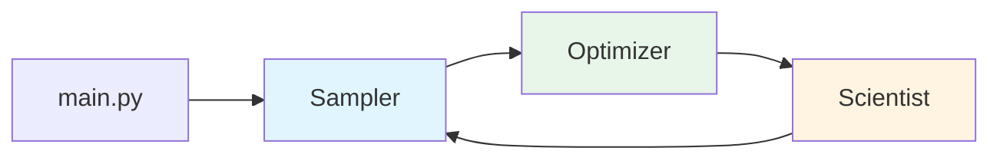

# 전체 코드 흐름 (Total Process Flow)

이 문서는 ODE LLM SR 시스템의 전체 코드 실행 흐름을 **Sampler**, **Optimizer**, **Scientist** 3개 주요 컴포넌트로 나누어 설명합니다.

---

## 시스템 개요

### 전체 구조



### 실행 흐름

```
main.py (반복 루프)
  ↓
┌─────────────────────────────────────┐
│ Iteration N                         │
├─────────────────────────────────────┤
│ 1. Sampler: 항 제안                 │
│    - LLM이 수식 생성                │
│    - 항 리스트 → Python 코드 변환   │
│                                     │
│ 2. Optimizer: 계수 최적화            │
│    - DE + BFGS로 params 찾기        │
│    - MSE 계산                       │
│                                     │
│ 3. Scientist: 항 평가 및 피드백      │
│    - Ablation study                 │
│    - LLM이 항별 평가                │
│    - 제거 목록 업데이트              │
└─────────────────────────────────────┘
  ↓
Iteration N+1 (Scientist 피드백 반영)
```

### 파일별 역할 분류

| 컴포넌트 | 관련 파일 | 역할 |
|:---|:---|:---|
| **Sampler** | `prompt.py`, `with_structured_output.py`, `utils.py` (일부) | 프롬프트 생성, 항 제안, 코드 변환 |
| **Optimizer** | `optimization.py` | DE/BFGS 최적화, MSE 계산 |
| **Scientist** | `prompt.py` (일부), `utils.py` (일부) | Ablation study, 항 평가, 피드백 생성 |
| **공통** | `main.py`, `evolution.py`, `io_utils.py` | 실행 관리, 상태 그래프, 로그 저장 |

---

## 1. Sampler: 항 제안 및 코드 생성

### 역할
LLM을 사용하여 ODE 항을 제안하고, 이를 실행 가능한 Python 함수로 변환합니다.

### 관련 코드

#### **evolution.py**
- `make_prompt()`: Sampler 프롬프트 생성
- `sampler()`: LLM 호출하여 항 제안 받기
- `parse_candidates()`: 항 리스트 → Python 코드 변환

#### **prompt.py**
- `make_sampler_ODE_prompt()`: 프롬프트 문자열 생성
- `format_scientist_insight_for_prompt()`: Scientist 피드백 포맷팅

#### **with_structured_output.py**
- `create_function_output_class()`: LLM 출력 스키마 동적 생성
- `TermSuggestion`: 항 제안 데이터 클래스

#### **utils.py**
- `terms_to_function_code()`: 항 리스트 → Python 함수 코드
- `remap_param_indices()`: params 인덱스 정규화
- `validate_terms()`: 항 검증

---

### 1.1 프롬프트 생성 (make_prompt)

```python
# evolution.py - make_prompt()

def make_prompt(self, state: GraphState) -> GraphState:
    # 1. Scientist 피드백 가져오기
    term_evaluations = state.get('scientist_analysis_metadata', {}).get('term_evaluations')
    removed_terms = state.get('removed_terms_per_dim')
    
    # 2. Soft Forgetting 적용 (확률적으로 일부 제거 항목 용서)
    forbidden_terms = apply_forgetting(removed_terms, self.forget_probability)
    
    # 3. 프롬프트 생성
    prompt = make_sampler_ODE_prompt(
        x_cols=['x0', 'x1'],
        func_names='x0_t, x1_t',
        max_params=8,
        insight_list=[accumulated_insight],
        removed_terms_per_dim=forbidden_terms,
        term_evaluations=term_evaluations,
        describe=system_description
    )
    
    return {**state, 'sampler_prompt': prompt}
```

**프롬프트 구성 요소**:
- 시스템 설명 (물리적 의미)
- Scientist의 축적된 인사이트
- 이전 항별 평가 결과 (KEEP/HOLD1/HOLD2)
- 제거된 항 목록 (Ban List)
- 필수 조건 (변수, params 사용법)

---

### 1.2 LLM 호출 (sampler)

```python
# evolution.py - sampler()

def sampler(self, state: GraphState) -> GraphState:
    # 1. 동적 스키마 생성 (dimension에 따라)
    FunctionOutput = create_function_output_class(
        dim=2,  # 2D 시스템
        num_equations=1,  # 1개 pair 생성
        max_params=8
    )
    
    # 2. LLM 호출
    llm = self.llm.with_structured_output(FunctionOutput)
    result = llm.invoke([HumanMessage(content=state['sampler_prompt'])])
    
    return {**state, 'sampler_output': result.model_dump()}
```

**LLM 출력 예시**:
```json
{
  "ode_pairs": [
    {
      "x0_t": [
        {"term": "params[0]*x0*x1", "reasoning": "질량 작용 역학"},
        {"term": "params[1]*x1", "reasoning": "회복률"}
      ],
      "x1_t": [
        {"term": "params[0]*x0*x1", "reasoning": "감염 증가"},
        {"term": "params[1]*x1", "reasoning": "제거"}
      ],
      "pair_reasoning": "SIR 모델의 핵심 역학"
    }
  ]
}
```

---

### 1.3 코드 변환 (parse_candidates)

```python
# evolution.py - parse_candidates()

def parse_candidates(self, state: GraphState) -> GraphState:
    ode_pairs = state['sampler_output']['ode_pairs']
    raw_candidates = []
    
    for pair in ode_pairs:
        codes = {}
        term_reasonings = {}
        
        for func_name in ['x0_t', 'x1_t']:
            # 1. 항 추출
            terms = [ts['term'] for ts in pair[func_name]]
            reasonings = [ts['reasoning'] for ts in pair[func_name]]
            
            # 2. 검증
            is_valid, error = validate_terms(terms, func_name, dim=2, max_params=8)
            
            if is_valid:
                # 3. Python 코드 생성
                code = terms_to_function_code(terms, func_name, dim=2, max_params=8)
                codes[func_name] = code
                term_reasonings[func_name] = reasonings
        
        raw_candidates.append({
            'codes': codes,
            'pair_reasoning': pair['pair_reasoning'],
            'term_reasonings': term_reasonings
        })
    
    return {**state, 'raw_candidates': raw_candidates}
```

**변환 과정** (`terms_to_function_code`):

```python
# utils.py - terms_to_function_code()

def terms_to_function_code(terms, func_name, dim, max_params):
    # Step 1: params 인덱스 정규화 (0부터 연속적으로)
    terms, mapping = remap_param_indices(terms)
    # ["params[3]*x0", "params[7]*x1"] → ["params[0]*x0", "params[1]*x1"]
    
    # Step 2: params[] 없는 항 자동 래핑
    # "-0.4000*x0*x1" → "params[0]*(-0.4000*x0*x1)"
    
    # Step 3: NumPy 접두사 추가
    # "sin(x0)" → "np.sin(x0)"
    
    # Step 4: 상수 항 추가
    # "... + params[N] * 1"
    
    # Step 5: Python 함수 생성
    return f"""def {func_name}(x0, x1, params):
    import numpy as np
    return {expression}"""
```

**출력**:
```python
raw_candidates = [
    {
        'codes': {
            'x0_t': 'def x0_t(x0, x1, params): return (params[0]*x0*x1) + (params[1]*x1) + params[2] * 1',
            'x1_t': 'def x1_t(x0, x1, params): return (params[0]*x0*x1) + (params[1]*x1) + params[2] * 1'
        },
        'pair_reasoning': 'SIR 모델의 핵심 역학',
        'term_reasonings': {...}
    }
]
```

---

## 2. Optimizer: 계수 최적화 및 평가

### 역할
생성된 Python 함수의 계수(params)를 최적화하고, MSE를 계산하여 최적 후보를 선택합니다.

### 관련 코드

#### **evolution.py**
- `evaluate_candidates()`: 병렬 최적화 실행
- `select_best()`: 최적 후보 선택
- `_evaluate_single_candidate()`: 단일 함수 최적화 (병렬 작업 단위)

#### **optimization.py**
- `run_differential_evolution()`: DE 최적화
- `run_bfgs_optimization()`: BFGS 최적화
- `calculate_scores()`: MSE 계산
- `create_loss_function()`: 손실 함수 생성


---

### 2.1 병렬 최적화 (evaluate_candidates)

```python
# evolution.py - evaluate_candidates()

def evaluate_candidates(self, state: GraphState) -> GraphState:
    raw_candidates = state['raw_candidates']
    
    # 1. 모든 (pair, dimension) 조합을 병렬 작업으로 준비
    eval_tasks = []
    for pair_idx, pair in enumerate(raw_candidates):
        for func_name in ['x0_t', 'x1_t']:
            code = pair['codes'][func_name]
            y_true = df_train[target_col].values
            
            eval_tasks.append((
                code, func_name, df_train_dict, y_true,
                max_params, use_de, de_tol, bfgs_tol
            ))
    
    # 2. 병렬 실행 (CPU 코어 수만큼)
    with Pool(processes=cpu_count()) as pool:
        results = pool.map(_evaluate_single_candidate, eval_tasks)
    
    # 3. 결과 재구성
    evaluated_candidates = rebuild_pairs(results, raw_candidates)
    
    return {**state, 'evaluated_candidates': evaluated_candidates}
```

---

### 2.2 단일 함수 최적화 (_evaluate_single_candidate)

```python
# evolution.py - _evaluate_single_candidate()

def _evaluate_single_candidate(args):
    code, func_name, df_train, y_true, max_params, use_de, de_tol, bfgs_tol = args
    
    # 1. 코드 → 함수 객체
    func = make_function_from_code(code, func_name)
    
    # 2. Differential Evolution (선택적)
    if use_de:
        de_params, de_score = run_differential_evolution(
            func, df_train, y_true, max_params, tol=de_tol
        )
        init_params = de_params
    else:
        init_params = np.ones(max_params)
    
    # 3. BFGS 최적화
    best_params = run_bfgs_optimization(
        func, df_train, y_true, init_params, tol=bfgs_tol
    )
    
    # 4. MSE 계산
    score = calculate_scores(
        func_list=[func],
        params_list=[best_params],
        df_dict={'train': df_train},
        dt_cols=[func_name]
    )['train'][0]
    
    return {'score': score, 'optimized_params': best_params}
```

---

### 2.3 최적화 알고리즘

#### **Differential Evolution**

```python
# optimization.py - run_differential_evolution()

def run_differential_evolution(func, df, y_true, max_params, tol):
    bounds = [(-100, 100)] * max_params  # 탐색 범위
    
    config = {
        'strategy': 'best1bin',
        'maxiter': 1000,
        'popsize': 15,
        'tol': 0.01,
        'mutation': (0.5, 1),
        'recombination': 0.7
    }
    
    def objective(params):
        return create_loss_function(func, df, y_true)(params)
    
    result = differential_evolution(objective, bounds, **config)
    return result.x, result.fun  # params, MSE
```

**특징**:
- 전역 최적화 (Global Optimization)
- 넓은 범위 탐색
- 지역 최적해 회피
- 느림 (~10-15초/함수)

#### **BFGS Optimization**

```python
# optimization.py - run_bfgs_optimization()

def run_bfgs_optimization(func, df, y_true, initial_params, tol):
    def objective(params):
        return create_loss_function(func, df, y_true)(params)
    
    result = minimize(
        objective,
        initial_params,
        method='BFGS',
        options={'maxiter': 1000, 'gtol': 1e-5}
    )
    
    return result.x  # optimized params
```

**특징**:
- 지역 최적화 (Local Optimization)
- 빠른 수렴
- 좋은 초기값 필요
- 빠름 (~2-3초/함수)

---

### 2.4 후보 선택 (select_best)

```python
# evolution.py - select_best()

def select_best(self, state: GraphState) -> GraphState:
    evaluated_candidates = state['evaluated_candidates']
    
    # 1. 최적 후보 선택 (후보 수 = 1이므로 첫 번째 선택)
    current_best = evaluated_candidates[0]
    
    # 2. 전체 데이터셋 점수 계산
    score_dict = calculate_scores(
        func_list=func_list,
        params_list=params_list,
        df_dict={'train': df_train, 'test_id': df_test_id, 'test_ood': df_test_ood},
        target_cols=['x0_t', 'x1_t']
    )
    
    return {
        **state,
        'current_pair': current_best,
        'score': score_dict,
        'func_list': func_list,
        'params_list': params_list,
        'generated_code': code_list
    }
```

**참고**: 현재 설정에서는 Sampler가 1개 pair만 생성하므로 (`num_equations=1`), 별도의 비교 로직 없이 해당 pair를 선택합니다.

---

## 3. Scientist: 항 평가 및 피드백

### 역할
Ablation study로 항별 영향도를 측정하고, LLM을 사용하여 항을 평가하며, 다음 iteration을 위한 피드백을 생성합니다.

### 관련 코드

#### **evolution.py**
- `analyze_and_record_observation()`: Scientist 분석 실행
- `_call_llm_for_analysis_and_record()`: Scientist LLM 호출
- `update_global_best()`: Global Best 업데이트

#### **prompt.py**
- `make_analysis_and_record_prompt()`: Scientist 프롬프트 생성

#### **utils.py**
- `calculate_term_performance_impacts()`: Ablation study
- `determine_action()`: Action 결정 (keep/hold/remove)
- `extract_term_skeleton()`: 스켈레톤 추출
- `merge_remove_list()`: 제거 목록 병합

---

### 3.1 Ablation Study (항별 영향도 측정) - 실제 구현

**핵심 원리**: 각 항의 파라미터를 **0으로 설정**하여 해당 항이 없을 때의 성능을 측정합니다.

#### Step 1: Baseline MSE 계산 (전체 항 포함)

```python
# utils.py - calculate_term_performance_impacts()

# 현재 함수 (이미 최적화된 상태)
# x0_t = params[0]*x0*x1 + params[1]*x1 + params[2]*1
# params = [1.0000, 0.5000, 0.0001]  (BFGS로 최적화됨)

func = make_function_from_code(code, func_name)
x_arrays = get_x_arrays_for_function(func, df_train, params)
y_pred_full = func(*x_arrays)  # params는 x_arrays에 포함됨
y_true = df_train[target_col].values

mse_baseline = np.mean((y_pred_full - y_true) ** 2)
# 예: mse_baseline = 1.0e-09
```

#### Step 2: 각 항을 제거하고 MSE 재계산

**중요**: 코드를 수정하거나 재최적화하지 않고, **해당 파라미터만 0으로 설정**합니다.

```python
# utils.py - ablation_test_single_term()

def ablation_test_single_term(code_str, func_name, term_idx, params, df, target_col):
    # 1. 파라미터 복사 후 해당 인덱스만 0으로 설정
    params_ablated = params.copy()
    params_ablated[term_idx] = 0.0
    
    # 예: term_idx=0 제거
    # params = [1.0000, 0.5000, 0.0001]
    # params_ablated = [0.0000, 0.5000, 0.0001]
    # → x0_t = 0.0000*x0*x1 + 0.5000*x1 + 0.0001*1
    #        = 0.5000*x1 + 0.0001*1  (첫 번째 항 제거됨)
    
    # 2. 동일한 코드로 함수 실행 (파라미터만 변경)
    func = make_function_from_code(code_str, func_name)
    x_arrays = get_x_arrays_for_function(func, df, params_ablated)
    y_pred = func(*x_arrays)
    y_true = df[target_col].values
    
    # 3. MSE 계산
    mse = np.mean((y_pred - y_true) ** 2)
    return mse
```

#### Step 3: 영향도 계산

```python
# 각 항에 대해 반복
for term_idx in range(len(params)):
    # 파라미터가 이미 0이면 스킵 (사용되지 않는 항)
    if abs(params[term_idx]) < 1e-10:
        continue
    
    # 해당 항 제거 시 MSE
    mse_without = ablation_test_single_term(
        code, func_name, term_idx, params, df_train, target_col
    )
    
    # 변화율 계산
    change_rate = (mse_without - mse_baseline) / (mse_baseline + 1e-10)
    
    # 영향도 분류
    if change_rate > 0.05:  # 5% threshold
        impact = 'positive'   # 제거 시 MSE 증가 → 중요한 항
    elif change_rate < -0.05:
        impact = 'negative'   # 제거 시 MSE 감소 → 불필요한 항
    else:
        impact = 'neutral'    # 거의 변화 없음
    
    term_impacts.append({
        'term_idx': term_idx,
        'impact': impact,
        'change_rate': change_rate,
        'mse_baseline': mse_baseline,
        'mse_without': mse_without
    })
```

#### 실제 예시 (ode_031)

**함수**:
```python
x1_t = params[0]*(0.4*x0*x1) + params[1]*(-0.314*x1) + params[2]*1
params = [1.0001, 0.9999, -0.0002]
```

**Ablation 결과**:

| 항 | params 설정 | MSE | change_rate | impact |
|:---|:---|:---|:---|:---|
| **Baseline** | `[1.0001, 0.9999, -0.0002]` | `9.77e-09` | - | - |
| **항 0 제거** | `[0.0000, 0.9999, -0.0002]` | `5.23e-05` | `+5350배` | **positive** |
| **항 1 제거** | `[1.0001, 0.0000, -0.0002]` | `3.14e-06` | `+321배` | **positive** |
| **항 2 제거** | `[1.0001, 0.9999, 0.0000]` | `9.65e-09` | `-1.2%` | **neutral** |

**해석**:
- 항 0 (`params[0]*(0.4*x0*x1)`): 제거 시 MSE가 5350배 증가 → **매우 중요**
- 항 1 (`params[1]*(-0.314*x1)`): 제거 시 MSE가 321배 증가 → **중요**
- 항 2 (`params[2]*1`): 제거 시 거의 변화 없음 → **불필요** (상수항)

#### 왜 재최적화하지 않는가?

**재최적화 방식** (사용하지 않음):
```python
# 항 제거 → 새로운 코드 생성 → BFGS 재실행
# 문제: 시간이 너무 오래 걸림 (항당 2-3초 × 항 개수)
```

**파라미터 0 설정 방식** (실제 사용):
```python
# 파라미터만 0으로 설정 → 즉시 계산
# 장점: 매우 빠름 (항당 0.01초), 충분히 정확함
```

**정당성**:
- 파라미터가 이미 최적화된 상태이므로, 한 항을 제거했을 때 다른 항들이 보상할 수 있는 여지가 제한적
- 실제로 중요한 항은 제거 시 성능이 크게 떨어지므로, 재최적화 없이도 충분히 구분 가능

**출력**:
```python
{
    'x0_t': [...],
    'x1_t': [
        {
            'term_idx': 0,
            'impact': 'positive',
            'change_rate': 53.50,
            'mse_baseline': 9.77e-09,
            'mse_without': 5.23e-05
        },
        {
            'term_idx': 1,
            'impact': 'positive',
            'change_rate': 3.21,
            'mse_baseline': 9.77e-09,
            'mse_without': 3.14e-06
        },
        {
            'term_idx': 2,
            'impact': 'neutral',
            'change_rate': -0.012,
            'mse_baseline': 9.77e-09,
            'mse_without': 9.65e-09
        }
    ]
}
```


---

### 3.2 Scientist LLM 호출

```python
# evolution.py - analyze_and_record_observation()

def analyze_and_record_observation(self, state: GraphState) -> GraphState:
    current_pair = state['current_pair']
    global_best = state['best_pair']
    prev_gen = state['previous_generation_pair']
    
    # 1. Ablation study 실행
    term_impacts = calculate_term_performance_impacts(
        current_codes=current_pair['codes'],
        current_params=current_pair['dim_params'],
        df_train=self.df_train,
        target_cols=['x0_t', 'x1_t'],
        threshold=0.05
    )
    
    # 2. 3-way 비교 데이터 준비
    observation = {
        'global_best_codes': global_best.get('codes', {}),
        'global_best_dim_scores': global_best.get('dim_scores', {}),
        'prev_gen_codes': prev_gen.get('codes', {}),
        'prev_gen_dim_scores': prev_gen.get('dim_scores', {}),
        'current_codes': current_pair['codes'],
        'current_dim_scores': current_pair['dim_scores'],
        'term_reasonings': current_pair['term_reasonings'],
        'term_impacts': term_impacts  # Ablation 결과
    }
    
    # 3. Scientist LLM 호출
    analysis_result, prompt = self._call_llm_for_analysis_and_record(
        observations=[observation],
        outcome_type='LOCAL_IMPROVEMENT',
        describe=state['describe'],
        notebook=state['research_notebook'],
        removed_terms_per_dim=state['removed_terms_per_dim'],
        current_iteration=35,
        total_iterations=300
    )
    
    # 4. Action 결정 및 제거 목록 업데이트
    updated_removed_terms = update_remove_list(
        analysis_result.term_evaluations,
        term_impacts,
        prev_term_evals=state.get('scientist_analysis_metadata', {}).get('term_evaluations')
    )
    
    # 5. Notebook 업데이트
    updated_notebook = {
        'accumulated_insight': analysis_result.updated_insight
    }
    
    return {
        **state,
        'research_notebook': updated_notebook,
        'scientist_analysis_metadata': analysis_result.model_dump(),
        'removed_terms_per_dim': updated_removed_terms
    }
```

---

### 3.3 Action 결정

```python
# utils.py - determine_action()

def determine_action(semantic_quality, impact, prev_action=None):
    # Rule 1: bad → 즉시 remove
    if semantic_quality == 'bad':
        return 'remove'
    
    # Rule 2: good + positive → keep
    if semantic_quality == 'good' and impact == 'positive':
        return 'keep'
    
    # Rule 3: 그 외 → hold (상태 전이)
    if prev_action is None:
        return 'hold1'
    elif prev_action == 'hold1':
        return 'hold2'
    elif prev_action == 'hold2':
        return 'remove'
    else:
        return 'hold1'
```

**상태 전이 예시**:

| Iteration | Semantic | Impact | Prev Action | New Action | 설명 |
|:---|:---|:---|:---|:---|:---|
| 1 | neutral | neutral | - | hold1 | 첫 등장 |
| 2 | neutral | neutral | hold1 | hold2 | 2회 연속 hold |
| 3 | neutral | neutral | hold2 | remove | 3회 연속 hold → 제거 |

---

### 3.4 제거 목록 업데이트

```python
# utils.py - 제거 목록 업데이트 로직

removed_terms_per_dim = {}

for func_name, evals in term_evaluations.items():
    for idx, eval_item in enumerate(evals):
        action = eval_item['action']
        term = eval_item['term']
        
        if action == 'remove':
            # 스켈레톤 추출 (계수를 C로 치환)
            skeleton = extract_term_skeleton(term)
            # "1.0000*(-0.4000*x0*x1)" → "C*(-C*x0*x1)"
            
            # 제거 목록에 추가
            if func_name not in removed_terms_per_dim:
                removed_terms_per_dim[func_name] = []
            
            if skeleton not in removed_terms_per_dim[func_name]:
                removed_terms_per_dim[func_name].append(skeleton)
```

**제거 목록 예시**:
```python
{
    'x0_t': ['C * 1', 'C * x1**2'],
    'x1_t': ['C * 1', 'C * np.exp(x0)']
}
```

이 목록은 다음 iteration의 Sampler 프롬프트에 "Ban List"로 전달됩니다.

---

## 전체 데이터 흐름 요약

```
┌─────────────────────────────────────────────────────────────┐
│ Iteration N                                                 │
├─────────────────────────────────────────────────────────────┤
│                                                             │
│ [1] Sampler                                                 │
│   Input:  - Scientist 피드백 (term_evaluations)            │
│           - 제거 목록 (removed_terms_per_dim)               │
│           - 축적된 인사이트 (accumulated_insight)           │
│   Process: LLM 호출 → 항 제안 → Python 코드 변환           │
│   Output: raw_candidates (코드 + reasoning)                │
│                                                             │
│ [2] Optimizer                                               │
│   Input:  raw_candidates                                    │
│   Process: 병렬 최적화 (DE + BFGS) → MSE 계산              │
│   Output: evaluated_candidates (코드 + params + scores)    │
│                                                             │
│ [3] Scientist                                               │
│   Input:  current_pair (선택된 최적 후보)                  │
│   Process: Ablation study → LLM 평가 → Action 결정         │
│   Output: - updated_insight                                 │
│           - term_evaluations (항별 평가)                   │
│           - removed_terms_per_dim (업데이트된 Ban List)    │
│                                                             │
└─────────────────────────────────────────────────────────────┘
                          ↓
┌─────────────────────────────────────────────────────────────┐
│ Iteration N+1                                               │
│ (Scientist 피드백이 Sampler에 반영됨)                       │
└─────────────────────────────────────────────────────────────┘
```

---

## 실행 예시

```bash
# 전체 기능 활성화
python main.py \\
    --problem_name ode_031 \\
    --max_params 8 \\
    --dim 2 \\
    --evolution_num 300 \\
    --use_var_desc \\
    --use_differential_evolution \\
    --use_scientist

# 결과:
# - Sampler: LLM이 항 제안 (프롬프트에 Scientist 피드백 포함)
# - Optimizer: DE + BFGS로 계수 최적화 (~15초/iteration)
# - Scientist: 항 평가 및 다음 iteration 피드백 생성
```

**성능**:
- BFGS only: ~2-3초/iteration
- DE + BFGS: ~10-15초/iteration
- Scientist 추가: +1-2초/iteration
